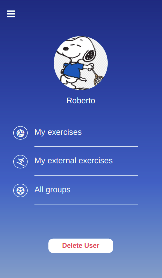
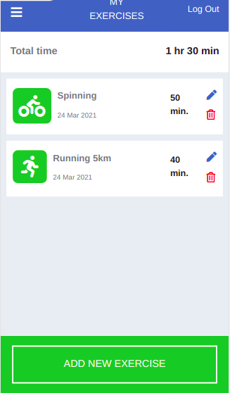
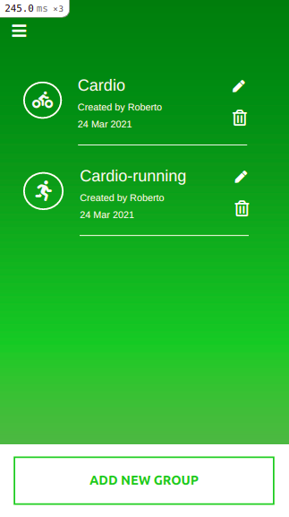
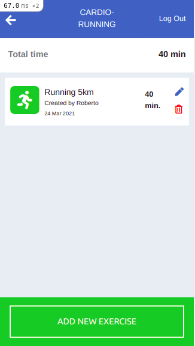

# App for tracking and grouping exercises

       

> I created a Ruby on Rails mobile app where users can register (just with a name) and create exercises and groups through ActiveRecord associations having has many/belongs to relationships between the models.

> Credit for the design idea (color, typography, layouts) goes to [Gregoire Vella](https://www.behance.net/gregoirevella) and his project: [Snapscan - iOs design and branding](https://www.behance.net/gallery/19759151/Snapscan-iOs-design-and-branding?tracking_source=).

- Is designed for mobile view, not properly optimized to be responsive.
- Consists of three models: user, exercise, and group, five controllers: users, sessions, home, exercises, and group; and five main views: users, home, sessions, exercises and groups.
- Basic user authentication and sessions are built from scratch.
- A user must be registered and logged in to be able to see and create exercises and groups.
- A user gets a profile image by default, but she/he is able to select a profile picture from his system during the registration process and within the 'Edit Profile' option.
- Groups are categories to organize the exercises.
- Exercises can be created with or without a group.
- A user can only see their created exercises.
- Exercises views show the total time spent doing exercises (with or wihout a group).
- A user can edit or delete her/his own account, and her/his own exercises/groups.

## Built With
- Ruby (v. 2.7.2)
- Ruby on Rails (v. 6.1.1)
- HTML / CSS
- Bootstrap
- Rubocop
- RSpec / Capybara
- Git
 
## How to run it
* It's recommended to use Git's latest version.
* Clone or download the repo from here [group-by-exercise](https://github.com/Milypm/group_by_exercise) on your local system.
- Click on the "Code" green button and copy HTTPS URL.
- Go to your local system, on an empty folder, to clone the repo: "git clone 'HTTPS URL'".
- Go to the repo root directory.
- Install the dependencies with: 'bundle install'.
- Migrate the database with: 'rails db:migrate'.
- Start the server: 'rails server' or 'rails s'.
- Copy/open the path given to open the project in the browser: 'http://localhost:3000/'.

## Testing with RSpec / Capybara
- On the command line, go to the application's root directory, and type: 'rspec'.
- You now should see the tests outcome for unit and integration tests included in the '/spec' directory.

## Author
**Mily Puente** :woman_technologist:
- GitHub: [@Milypm](https://github.com/Milypm)
- LinkedIn: [Mily Puente](https://www.linkedin.com/in/milypuentem/)
- Twitter: [@MilyPuente](https://twitter.com/MilyPuente)
 
## Contribute :point_left:
Any advice and suggestion for improvement are more than welcome.
Visit [issues' section](https://github.com/Milypm/group_by_exercise/issues)

## Show your support
Give a :star2: if you like this project!

## License

This project is <a href="../feature/LICENSE">MIT</a> licensed.
